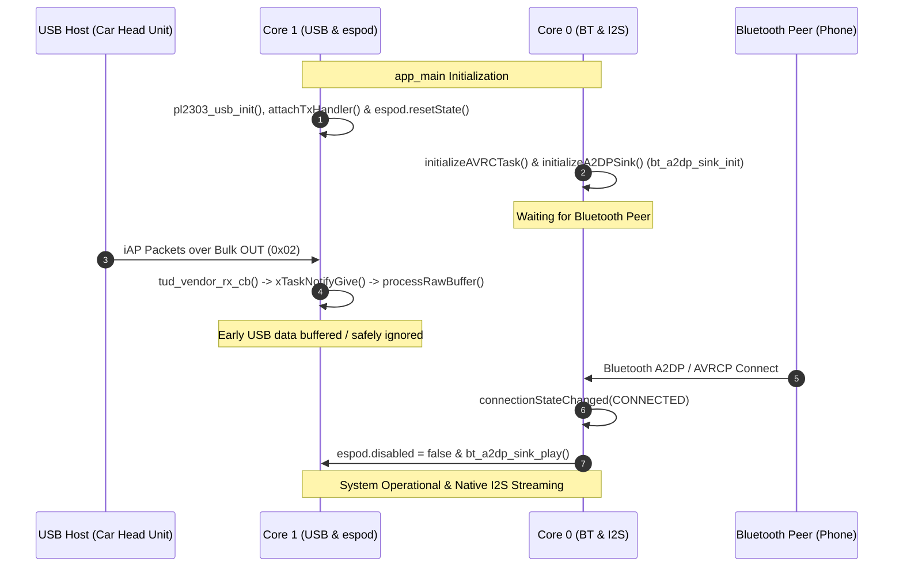
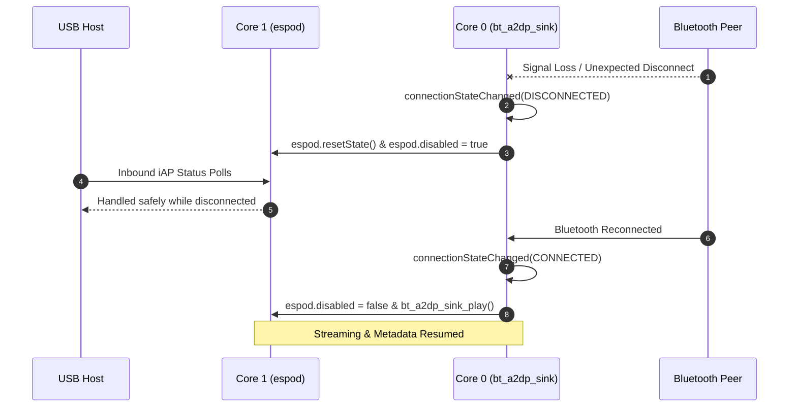
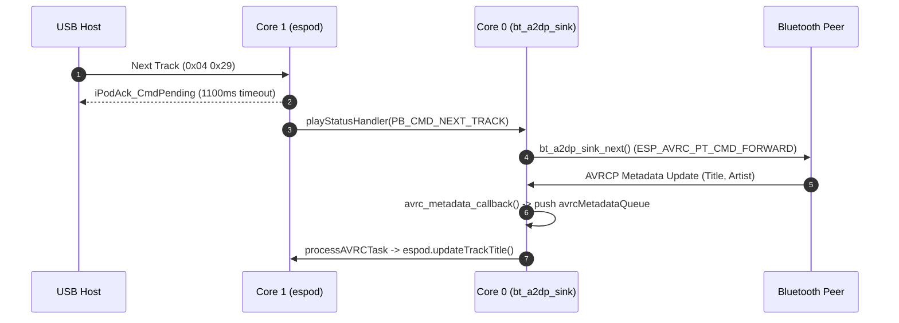

# superPod Theory of Operation (TOO), Use Cases & Event Sequences

This document details the logical event sequences, FreeRTOS task interactions, error recovery mechanisms, communication timeout guards, and CPU priority race condition analysis for the unified **`superPod`** firmware running on the **ESP32-S31** with native local component `bt_a2dp_sink`.

---

## 1. Sequence 1: System Boot, Early USB Data & Bluetooth Peer Discovery

### Operational Flow
1. **System Power-On & Initialization (`app_main`)**:
   - `pl2303_usb_init` configures native USB-OTG PL2303 hardware and starts TinyUSB task on **Core 1** (`CONFIG_TINYUSB_TASK_CORE`).
   - Centralized log verbosity configured for `PL2303_USB`, `esPod`, and `SUPERPOD_MAIN` (`ESP_LOG_DEBUG`).
   - `pl2303_usb_init` configures native USB-OTG PL2303 hardware with host-adaptive virtual line coding, pure virtual control lines (`CONFIG_DTR_PIN = -1`, `CONFIG_RTS_PIN = -1`), and starts TinyUSB task on **Core 1** (`CONFIG_TINYUSB_TASK_CORE`).
   - `espod` stack initialized on **Core 1** with state reset (`espod.disabled = true`).
   - Outbound USB transmit callback (`usb_tx_handler`) is attached to `espod.attachTxHandler()`.
   - `usb_espod_bridge_task` launched on **Core 1** (`CONFIG_USB_ESPOD_BRIDGE_TASK_PRIORITY`, stack `CONFIG_USB_ESPOD_BRIDGE_TASK_STACK_SIZE`) and registers its task handle via `pl2303_usb_set_rx_task_handle()`.
   - `initializeAVRCTask` and `initializeA2DPSink` initialize native Bluetooth Classic Bluedroid A2DP Sink (`bt_a2dp_sink_init`, `bt_a2dp_sink_start`) and I2S DAC driver (`i2s_audio_init` using `esp_driver_i2s` in `i2s_std` mode) on **Core 0** (`CONFIG_BT_BLUEDROID_PIN_TO_CORE`).
2. **Early USB Traffic Handling**:
   - If the USB Host (head unit / dock) is plugged in before a Bluetooth peer connects, iAP packets arrive over USB Bulk OUT (`CONFIG_EP_VENDOR_BULK_OUT` / `0x02`).
   - TinyUSB triggers callback `tud_vendor_rx_cb()`, which executes `xTaskNotifyGive()` to wake `usb_espod_bridge_task` instantly with zero delay.
   - `usb_espod_bridge_task` reads raw bytes via `pl2303_usb_read_bytes()` and transfers them into `espod.processRawBuffer()`.
   - Because `espod.disabled` is `true`, non-discovery commands receive an acknowledgment or are ignored safely. Ringbuffers do not overflow, and no unhandled exceptions occur.
3. **Bluetooth Connection Established**:
   - Bluetooth peer pairs and connects. `connectionStateChanged` receives `ESP_A2D_CONNECTION_STATE_CONNECTED`.
   - Sets `espod.disabled = false` and invokes `bt_a2dp_sink_play()`. Full iAP control and metadata synchronization activate.

---

## 2. Sequence 2: Unexpected Bluetooth Disconnection & Recovery

### Operational Flow
1. **Active Audio Streaming**:
   - Audio PCM data received in `bt_app_a2d_data_cb()` is written directly to I2S DMA via `i2s_audio_write()`. AVRCP metadata (Title, Artist, Album, Duration, Position) updates `espod` state via `avrcMetadataQueue`.
2. **Unexpected Bluetooth Disconnection**:
   - Peer moves out of range or loses power. `connectionStateChanged` receives `ESP_A2D_CONNECTION_STATE_DISCONNECTED`.
   - `connectionStateChanged` executes `espod.resetState()` and sets `espod.disabled = true`.
   - Pending iAP timers (`_pendingTimer_0x00`, `_pendingTimer_0x04`) and TX queue items are cancelled cleanly.
3. **GAP Connection Retry Phase**:
   - Bluetooth GAP remains in connectable & discoverable mode (`esp_bt_gap_set_scan_mode`).
   - During the disconnected state, incoming USB iAP commands from the host are handled without blocking or hanging.
4. **Peer Reconnection**:
   - Peer returns to range and reconnects (`ESP_A2D_CONNECTION_STATE_CONNECTED`).
   - `connectionStateChanged` re-enables `espod` (`espod.disabled = false`) and invokes `bt_a2dp_sink_play()`. Audio and metadata resume seamlessly.

---

## 3. Sequence 3: High-Frequency Host Polling & Ringbuffer Overflow Protection

### Operational Flow
1. **High-Frequency Host Polling**:
   - Host sends iAP status requests (`GetPlayStatus` `0x04 0x1C`) at high rate (e.g. 100 Hz).
2. **Buffer Overflow Safeguards**:
   - `processRawBuffer` writes to `_cmdRingBuffer` (size 2048 bytes) using non-blocking `xRingbufferSend` with a 10ms timeout (`CMD_RING_BUF_TIMEOUT`).
   - If buffer is full, excess bytes are safely dropped with warning log `cmdRingBuffer full, dropping X raw bytes`.

---

## 4. Sequence 4: Rapid Track Skipping & AVRCP Race Condition Prevention

### Operational Flow
1. **Rapid Track Skipping**:
   - Host sends multiple `PlayControl` Next Track (`0x04 0x29`) commands in rapid succession.
2. **Asynchronous Command Handling**:
   - `L0x04::processLingo` updates internal track indices, returns `iPodAck_CmdPending` with timeout parameter `TRACK_CHANGE_TIMEOUT` (1100ms) to host, and triggers `playStatusHandler(PB_CMD_NEXT_TRACK)`.
   - `playStatusHandler` dispatches `bt_a2dp_sink_next()` on Core 0, which sends AVRCP passthrough key (`ESP_AVRC_PT_CMD_FORWARD`).
3. **Decoupled Metadata Queue**:
   - AVRCP metadata updates from Bluetooth stack arrive asynchronously on Core 0 (`bt_app_rc_ct_cb(ESP_AVRC_CT_METADATA_RSP_EVT)`).
   - `avrc_metadata_callback` allocates metadata items and pushes them into `avrcMetadataQueue` (`CONFIG_AVRC_QUEUE_SIZE`).
   - `processAVRCTask` (`CONFIG_PROCESS_AVRC_TASK_PRIORITY`) consumes items from queue and updates `espod` track titles/artists safely without blocking Bluetooth ISRs or Core 1 iAP tasks.

---

## 5. Sequence 5: Outbound USB Response Routing

### Operational Flow
1. **Response Generation**:
   - When `esPod` processes incoming lingo commands (e.g. `GetiPodOptions`, `GetPlayStatus`), response packets are formatted and pushed into `_txQueue` via `_queuePacket()`.
2. **Transport Dispatch**:
   - `esPod::_txTask` pops packets from `_txQueue`.
   - `_txTask` checks if `_rawTxHandler` callback is attached (`espod.attachTxHandler(usb_tx_handler)`).
   - If attached, `_txTask` invokes `usb_tx_handler(data, len)`, which calls `pl2303_usb_write_bytes()` to transfer payload to the USB Bulk IN endpoint (`0x83`).

---

## 6. Comprehensive Communication Timeout Matrix

The following table summarizes all hardware, protocol, and FreeRTOS queue timeout mechanisms enforced in `superPod` for bidirectional communication safety:

| Direction / Subsystem | Timeout Parameter | Value | Trigger Condition | System Guard Action |
| :--- | :--- | :--- | :--- | :--- |
| **USB Inbound (Host -> ESP32)** | `INTERBYTE_TIMEOUT` | **500 ms** | Partial or interrupted iAP packet transfer | Flushes partial packet buffer to prevent framing state contamination. |
| **USB Inbound (Host -> ESP32)** | `SERIAL_TIMEOUT` | **8000 ms** | Multi-chunk frame assembly stall | Resets RX packet assembly state and resumes start-byte scan (`0xFF 0x55`). |
| **USB Inbound (Host -> ESP32)** | `CMD_RING_BUF_TIMEOUT` | **10 ms** | Ringbuffer full under high-frequency host polling | `xRingbufferSend` drops excess bytes with warning log to prevent memory leaks. |
| **USB Outbound (ESP32 -> Host)** | `TX_QUEUE_TIMEOUT` | **50 ms** | FreeRTOS `_txFreeBufferQueue` allocation timeout | Prevents `_queuePacket` from blocking `espod` processing task if USB Bulk IN endpoint stalls. |
| **USB Inbound Notification** | `USB_NOTIFY_TIMEOUT` | **100 ms** | Safety timeout for `ulTaskNotifyTake()` in bridge task | Periodic fallback check ensuring incoming Bulk OUT bytes are processed even if ISR notification is missed. |
| **iAP Lingo 0x04 Protocol** | `TRACK_CHANGE_TIMEOUT` | **1100 ms** | Pending track change / play control ACK | `_pendingTimer_0x04` auto-fires `iPodAck_OK` to host if Bluetooth AVRCP metadata is delayed, preventing head unit UI freeze. |
| **Bluetooth A2DP Subsystem** | `I2S_DMA_WRITE_TIMEOUT` | **portMAX_DELAY** | PCM Audio streaming DMA write | Blocks calling thread when I2S DMA buffer is full, preventing audio sample drop or overrun. |
| **AVRCP Metadata Queue** | `AVRC_QUEUE_SEND_TIMEOUT` | **0 ms (Non-blocking)** | Metadata queue full under rapid track skipping | Drops item and immediately calls `free()` on payload, preventing memory corruption and Bluetooth ISR blocking. |

---

## 7. FreeRTOS Task Priority, Core Allocation & Race Condition Analysis

### Task Allocation & Priority Architecture Matrix

| Core Assignment | FreeRTOS Task | Priority Level | Blocking Primitives / Yield Mechanism | CPU Spin & Race Condition Guard |
| :--- | :--- | :--- | :--- | :--- |
| **Core 0 (PRO_CPU)** | **BT Controller Radio Task** | **23** (Highest) | Event-driven by radio hardware ISRs. | Yields CPU immediately when no RF packets are active. (`CONFIG_BT_CTRL_PIN_TO_CORE = 0`) |
| **Core 0 (PRO_CPU)** | **Bluedroid Host Stack** | **20** (High) | FreeRTOS Queue / Event Semaphore. | Blocks waiting for Bluetooth HCI events; zero polling. (`CONFIG_BT_BLUEDROID_PIN_TO_CORE = 0`) |
| **Core 0 (PRO_CPU)** | **A2DP Audio & I2S DMA Task** | **18** (Med-High) | I2S DMA Ringbuffer & Audio Stream queue. | Blocks when I2S DMA buffers are full or audio stream is paused. |
| **Core 0 (PRO_CPU)** | **`processAVRCTask`** | **6** (`CONFIG_PROCESS_AVRC_TASK_PRIORITY`) | `xQueueReceive(..., portMAX_DELAY)` | **Zero CPU Spin**: Blocks indefinitely until AVRCP metadata arrives. Stack size: `CONFIG_PROCESS_AVRC_TASK_STACK_SIZE` (4096). |
| **Core 1 (APP_CPU)** | **TinyUSB Device Task** | **15** (High) | USB-OTG Hardware Interrupt Semaphore. | Blocks on `tud_task()` event queue when USB bus is idle. (`CONFIG_TINYUSB_TASK_CORE = 1`) |
| **Core 1 (APP_CPU)** | **`usb_espod_bridge_task`** | **10** (`CONFIG_USB_ESPOD_BRIDGE_TASK_PRIORITY`) | `ulTaskNotifyTake(pdTRUE, pdMS_TO_TICKS(100))` | **Event-Driven**: Woken instantly by `tud_vendor_rx_cb()` (`xTaskNotifyGive()`), zero CPU spinning when idle. Stack size: `CONFIG_USB_ESPOD_BRIDGE_TASK_STACK_SIZE` (4096). |
| **Core 1 (APP_CPU)** | **`espod` `_processTask`** | **5** (Low) | `xRingbufferReceive(..., portMAX_DELAY)` | **Zero CPU Spin**: Blocks on `_cmdRingBuffer` until raw bytes are pushed. (`CONFIG_ESPOD_TASK_CORE = 1`) |
| **Core 1 (APP_CPU)** | **`espod` `_txTask`** | **20** (High) | `xQueueReceive(_txQueue, ..., portMAX_DELAY)` | Blocks until packet is queued for outbound Bulk IN transmission. |
| **Core 1 (APP_CPU)** | **`espod` `_timerTask`** | **1** (Lowest) | `xQueueReceive(_timerQueue, ..., portMAX_DELAY)` | Blocks until a software timer (e.g. `TRACK_CHANGE_TIMEOUT`) expires. |

---

## 8. Related Documentation Links

- [Root README](README.md)
- [Requirements Specification](docs/REQUIREMENTS.md)
- [Project Trace & Implementation Matrix](docs/PROJECT_TRACE.md)
- [esPod Component Documentation](components/espod/README.md)
- [PL2303 USB Transceiver Documentation](components/pl2303_usb/README.md)
- [BT A2DP Sink Component Documentation](components/bt_a2dp_sink/README.md)
