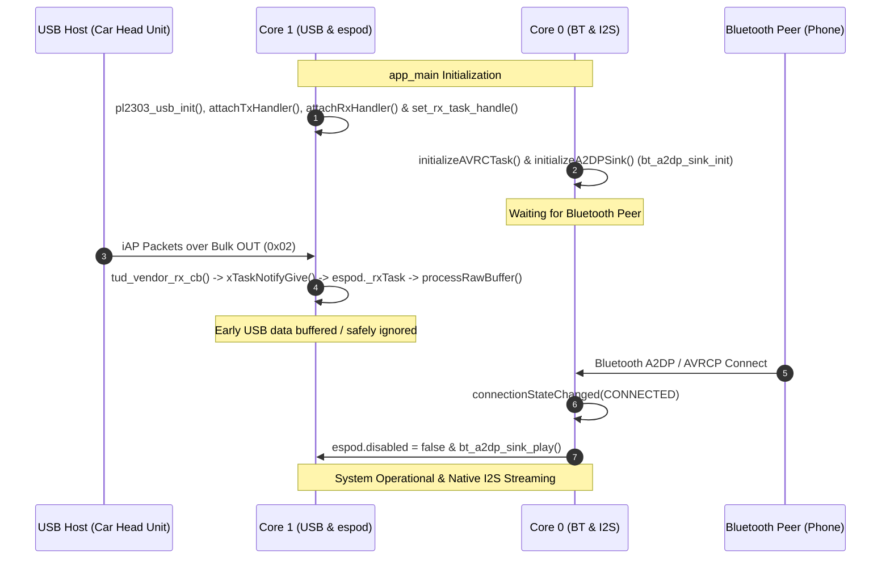
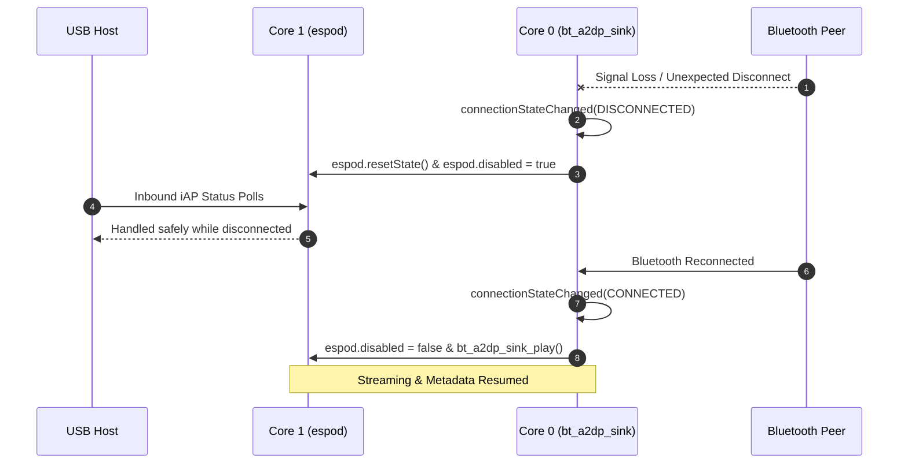
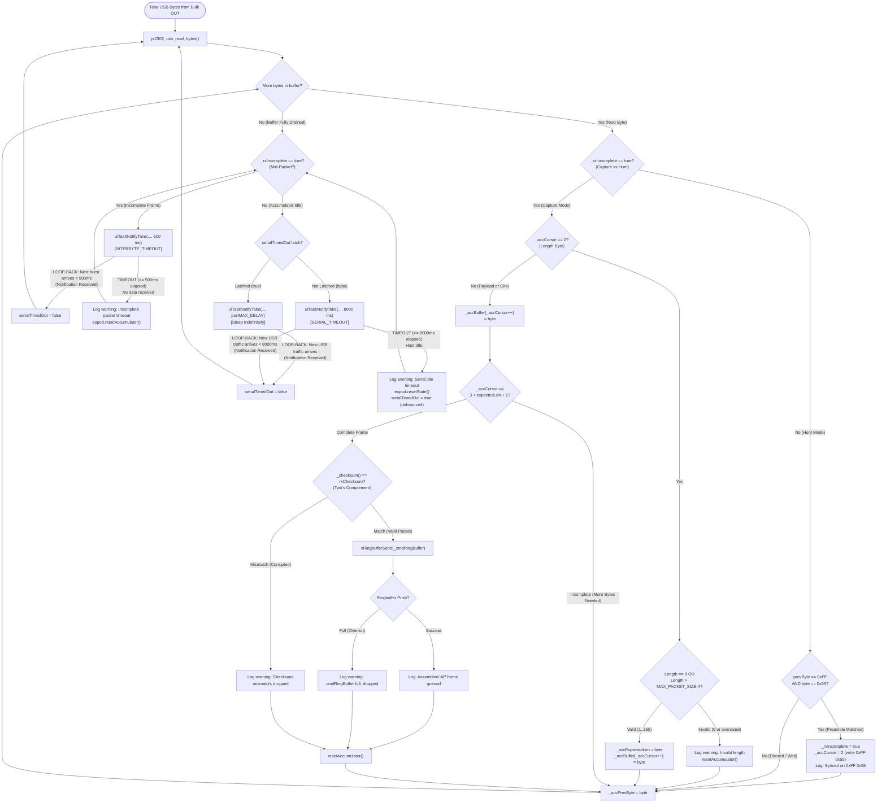
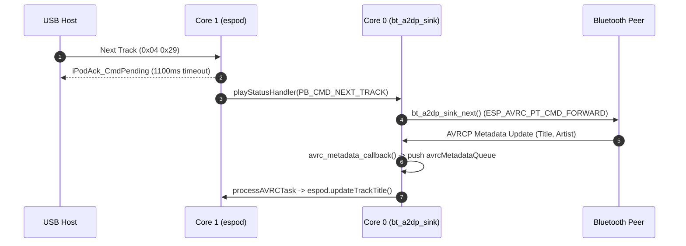

# superPod Theory of Operation (TOO), Use Cases & Event Sequences

This document details the logical event sequences, FreeRTOS task interactions, error recovery mechanisms, communication timeout guards, and CPU priority race condition analysis for the unified **`superPod`** firmware running on the **ESP32-S31** with `AudioTools` & `BluetoothA2DPSink`.

---

## 1. Sequence 1: System Boot, Early USB Data & Bluetooth Peer Discovery

### Operational Flow
1. **System Power-On & Initialization (`app_main`)**:
   - `pl2303_usb_init` configures native USB-OTG PL2303 hardware and starts TinyUSB task on **Core 1** (`CONFIG_TINYUSB_TASK_CORE`).
   - Centralized log verbosity configured for `PL2303_USB`, `esPod`, and `SUPERPOD_MAIN` (`ESP_LOG_DEBUG`).
   - `pl2303_usb_init` configures native USB-OTG PL2303 hardware with host-adaptive virtual line coding, pure virtual control lines (`CONFIG_DTR_PIN = -1`, `CONFIG_RTS_PIN = -1`), and starts TinyUSB task on **Core 1** (`CONFIG_TINYUSB_TASK_CORE`).
   - `espod` stack initialized on **Core 1** with state reset (`espod.disabled = true`).
   - Bidirectional USB transport callbacks attached: outbound `usb_tx_handler` via `espod.attachTxHandler()`, and inbound `pl2303_usb_read_bytes` via `espod.attachRxHandler()`.
   - TinyUSB driver registers `espod.getRxTaskHandle()` via `pl2303_usb_set_rx_task_handle()`, binding USB Bulk OUT hardware events directly to `esPod::_rxTask` on **Core 1** (Priority 10, Stack 4096).
   - `initializeAVRCTask` and `initializeA2DPSink` initialize Bluetooth Classic Bluedroid A2DP Sink (`a2dp_sink.start`) and I2S DAC driver (`i2s.begin`) on **Core 0** (`CONFIG_BT_BLUEDROID_PIN_TO_CORE`).
2. **Early USB Traffic Handling**:
   - If the USB Host (head unit / dock) is plugged in before a Bluetooth peer connects, iAP packets arrive over USB Bulk OUT (`CONFIG_EP_VENDOR_BULK_OUT` / `0x02`).
   - TinyUSB triggers callback `tud_vendor_rx_cb()`, which executes `xTaskNotifyGive(espod.getRxTaskHandle())` to wake `esPod::_rxTask` instantly with zero delay.
   - `esPod::_rxTask` drains raw bytes via `_rawRxHandler` (`pl2303_usb_read_bytes`) directly into `espod.processRawBuffer()`. No separate bridge task is required.
   - Because `espod.disabled` is `true`, non-discovery commands receive an acknowledgment or are ignored safely. Ringbuffers do not overflow, and no unhandled exceptions occur.
3. **Bluetooth Connection Established**:
   - Bluetooth peer pairs and connects. `connectionStateChanged` receives `ESP_A2D_CONNECTION_STATE_CONNECTED`.
   - Sets `espod.disabled = false` and invokes `bt_a2dp_sink_play()`. Full iAP control and metadata synchronization activate.

---

## 2. Sequence 2: Unexpected Bluetooth Disconnection & Recovery

### Operational Flow
1. **Active Audio Streaming**:
   - Audio PCM data received in `bt_app_a2d_data_cb()` is written directly to I2S DMA via `i2s_audio_write()`. AVRCP metadata (Title, Artist, Album, Duration, Position) updates `espod` state via `avrcMetadataQueue`.
2. **Unexpected Bluetooth Disconnection**:
   - Peer moves out of range or loses power. `connectionStateChanged` receives `ESP_A2D_CONNECTION_STATE_DISCONNECTED`.
   - `connectionStateChanged` executes `espod.resetState()` and sets `espod.disabled = true`.
   - Pending iAP timers (`_pendingTimer_0x00`, `_pendingTimer_0x04`) and TX queue items are cancelled cleanly.
3. **GAP Connection Retry Phase**:
   - Bluetooth GAP remains in connectable & discoverable mode (`esp_bt_gap_set_scan_mode`).
   - During the disconnected state, incoming USB iAP commands from the host are handled without blocking or hanging.
4. **Peer Reconnection**:
   - Peer returns to range and reconnects (`ESP_A2D_CONNECTION_STATE_CONNECTED`).
   - `connectionStateChanged` re-enables `espod` (`espod.disabled = false`) and invokes `bt_a2dp_sink_play()`. Audio and metadata resume seamlessly.

---

## 3. Sequence 3: USB Byte-Stream Packet Accumulator, Dynamic Timeout Guards & Debounce Latch

### Operational Flow
1. **Byte-Stream Arrival & Direct Component Ingestion**:
   - In single-MCU native USB operation, the USB host (e.g. Mini Cooper head unit) sends iAP command frames encapsulated in USB Bulk OUT endpoints (EP `0x02`).
   - The host often fragments frames into arbitrary chunk sizes (down to 1-byte USB transfers, e.g. `0xFF 0xFF 0x55 0x0E ...`).
   - `tud_vendor_rx_cb()` fires for every USB Bulk OUT packet received, triggering `xTaskNotifyGive()` to wake `esPod::_rxTask` directly (configured via `espod.attachRxHandler(pl2303_usb_read_bytes)` and `pl2303_usb_set_rx_task_handle(espod.getRxTaskHandle())`).
   - `esPod::_rxTask` drains the TinyUSB endpoint directly via the attached `_rawRxHandler` callback (`pl2303_usb_read_bytes()`) into its internal buffer and invokes `processRawBuffer()`, completely eliminating the need for an external bridge task or intermediate queue and saving 4 KB of stack RAM.

2. **Accumulator State Machine Inside `components/espod`**:
   - Because `esPod` is modularized across branches, the packet reassembly accumulator is implemented directly within `esPod::processRawBuffer()`.
   - **Hunt Mode (`!_rxIncomplete`)**:
     - Scans for the `0xFF 0x55` sync preamble.
     - Safely absorbs repeated `0xFF` bytes (such as the `0xFF 0xFF 0x55` sequence sent by the Mini Cooper host).
     - Upon matching `0xFF 0x55`, sets `_rxIncomplete = true`, initializes `_accCursor = 2`, and enters capture mode.
   - **Capture Mode (`_rxIncomplete`)**:
     - Extracts the payload length byte at cursor position 2. If length is 0 or exceeds buffer capacity, the frame is rejected with a warning log, and `resetAccumulator()` is called immediately.
     - Appends incoming bytes into `_accBuffer` until cursor reaches `2 (preamble) + 1 (length) + payloadLen + 1 (checksum)`.
     - Computes two's complement checksum `_checksum(&_accBuffer[3], payloadLen)`. If valid (`calcChecksum == rxChecksum`), the full assembled frame is pushed into `_cmdRingBuffer` for parsing by `_processTask`. If checksum verification fails, the corrupted frame is dropped with a warning log.
     - Resets accumulator state for the next frame.

3. **FreeRTOS Dynamic Notification Wait & Serial Idle Timeout Debounce**:
   - Instead of spinning or computing timestamp deltas, `esPod::_rxTask` uses dynamic wait ticks in `ulTaskNotifyTake`:
     - **Inter-Byte Timeout (`500 ms`)**: Active when `isRxIncomplete() == true`. If the host stalls mid-packet for $\ge 500\text{ ms}$, the task wakes on timeout, calls `resetAccumulator()`, logs a warning, and discards the partial frame.
     - **Serial Idle Timeout (`8000 ms`) with Debounce Latch**: When no packet is in progress, the task waits up to `SERIAL_TIMEOUT` (8000 ms). If the host stops transmitting, the timeout fires:
       - The task logs `Serial idle timeout (8000 ms), resetting esPod state machine`, invokes `resetState()`, and sets `serialTimedOut = true`.
       - With `serialTimedOut == true`, the task transitions its wait timeout to `portMAX_DELAY`, preventing continuous redundant periodic `resetState()` hammering.
       - Any subsequent USB Bulk OUT activity instantly wakes the task and clears `serialTimedOut = false`.

### Ingestion, Assembly, and Discard Flow Diagram

---

## 4. Sequence 4: Rapid Track Skipping & AVRCP Race Condition Prevention

### Operational Flow
1. **Rapid Track Skipping**:
   - Host sends multiple `PlayControl` Next Track (`0x04 0x29`) commands in rapid succession.
2. **Asynchronous Command Handling**:
   - `L0x04::processLingo` updates internal track indices, returns `iPodAck_CmdPending` with timeout parameter `TRACK_CHANGE_TIMEOUT` (1100ms) to host, and triggers `playStatusHandler(PB_CMD_NEXT_TRACK)`.
   - `playStatusHandler` dispatches `bt_a2dp_sink_next()` on Core 0, which sends AVRCP passthrough key (`ESP_AVRC_PT_CMD_FORWARD`).
3. **Decoupled Metadata Queue**:
   - AVRCP metadata updates from Bluetooth stack arrive asynchronously on Core 0 (`bt_app_rc_ct_cb(ESP_AVRC_CT_METADATA_RSP_EVT)`).
   - `avrc_metadata_callback` allocates metadata items and pushes them into `avrcMetadataQueue` (`CONFIG_AVRC_QUEUE_SIZE`).
   - `processAVRCTask` (`CONFIG_PROCESS_AVRC_TASK_PRIORITY`) consumes items from queue and updates `espod` track titles/artists safely without blocking Bluetooth ISRs or Core 1 iAP tasks.

---

## 5. Sequence 5: Outbound USB Response Routing

### Operational Flow
1. **Response Generation**:
   - When `esPod` processes incoming lingo commands (e.g. `GetiPodOptions`, `GetPlayStatus`), response packets are formatted and pushed into `_txQueue` via `_queuePacket()`.
2. **Transport Dispatch**:
   - `esPod::_txTask` pops packets from `_txQueue`.
   - `_txTask` checks if `_rawTxHandler` callback is attached (`espod.attachTxHandler(usb_tx_handler)`).
   - If attached, `_txTask` invokes `usb_tx_handler(data, len)`, which calls `pl2303_usb_write_bytes()` to transfer payload to the USB Bulk IN endpoint (`0x83`).

---

## 6. Comprehensive Communication Timeout Matrix

The following table summarizes all hardware, protocol, and FreeRTOS queue timeout mechanisms enforced in `superPod` for bidirectional communication safety:

| Direction / Subsystem | Timeout Parameter | Value | Trigger Condition | System Guard Action |
| :--- | :--- | :--- | :--- | :--- |
| **USB Inbound (Host -> ESP32)** | `INTERBYTE_TIMEOUT` | **500 ms** | Partial or interrupted iAP packet transfer (`espod.isRxIncomplete() == true`) | Dynamic FreeRTOS wait-for-notification timeout fires; invokes `espod.resetAccumulator()` to discard corrupted partial frame and prevent framing state desync. |
| **USB Inbound (Host -> ESP32)** | `SERIAL_TIMEOUT` | **8000 ms (with Debounce Latch)** | Host bus inactivity while accumulator is idle | Fires when no USB packets arrive for 8000 ms. Resets `espod.resetState()`, logs warning once, and latches `serialTimedOut = true` (switching wait to `portMAX_DELAY`) until new USB activity arrives. |
| **USB Inbound (Host -> ESP32)** | `CMD_RING_BUF_TIMEOUT` | **10 ms** | Ringbuffer full under high-frequency host polling | `xRingbufferSend` drops excess assembled frames with warning log to prevent memory leaks. |
| **USB Outbound (ESP32 -> Host)** | `TX_QUEUE_TIMEOUT` | **50 ms** | FreeRTOS `_txFreeBufferQueue` allocation timeout | Prevents `_queuePacket` from blocking `espod` processing task if USB Bulk IN endpoint stalls. |
| **iAP Lingo 0x04 Protocol** | `TRACK_CHANGE_TIMEOUT` | **1100 ms** | Pending track change / play control ACK | `_pendingTimer_0x04` auto-fires `iPodAck_OK` to host if Bluetooth AVRCP metadata is delayed, preventing head unit UI freeze. |
| **Bluetooth A2DP Subsystem** | `I2S_DMA_WRITE_TIMEOUT` | **portMAX_DELAY** | PCM Audio streaming DMA write | Blocks calling thread when I2S DMA buffer is full, preventing audio sample drop or overrun. |
| **AVRCP Metadata Queue** | `AVRC_QUEUE_SEND_TIMEOUT` | **0 ms (Non-blocking)** | Metadata queue full under rapid track skipping | Drops item and immediately calls `free()` on payload, preventing memory corruption and Bluetooth ISR blocking. |

---

## 7. FreeRTOS Task Priority, Core Allocation & Race Condition Analysis

### Task Allocation & Priority Architecture Matrix

| Core Assignment | FreeRTOS Task | Priority Level | Blocking Primitives / Yield Mechanism | CPU Spin & Race Condition Guard |
| :--- | :--- | :--- | :--- | :--- |
| **Core 0 (PRO_CPU)** | **BT Controller Radio Task** | **23** (Highest) | Event-driven by radio hardware ISRs. | Yields CPU immediately when no RF packets are active. (`CONFIG_BT_CTRL_PIN_TO_CORE = 0`) |
| **Core 0 (PRO_CPU)** | **Bluedroid Host Stack** | **20** (High) | FreeRTOS Queue / Event Semaphore. | Blocks waiting for Bluetooth HCI events; zero polling. (`CONFIG_BT_BLUEDROID_PIN_TO_CORE = 0`) |
| **Core 0 (PRO_CPU)** | **A2DP Audio & I2S DMA Task** | **18** (Med-High) | I2S DMA Ringbuffer & Audio Stream queue. | Blocks when I2S DMA buffers are full or audio stream is paused. |
| **Core 0 (PRO_CPU)** | **`processAVRCTask`** | **6** (`CONFIG_PROCESS_AVRC_TASK_PRIORITY`) | `xQueueReceive(..., portMAX_DELAY)` | **Zero CPU Spin**: Blocks indefinitely until AVRCP metadata arrives. Stack size: `CONFIG_PROCESS_AVRC_TASK_STACK_SIZE` (4096). |
| **Core 1 (APP_CPU)** | **TinyUSB Device Task** | **15** (High) | USB-OTG Hardware Interrupt Semaphore. | Blocks on `tud_task()` event queue when USB bus is idle. (`CONFIG_TINYUSB_TASK_CORE = 1`) |
| **Core 1 (APP_CPU)** | **`espod` `_rxTask`** | **10** (`CONFIG_RX_TASK_PRIORITY`) | `ulTaskNotifyTake(pdTRUE, waitTicks)` | **Universal Event-Driven Ingestion**: Woken instantly by `tud_vendor_rx_cb()` (`xTaskNotifyGive()`) via attached `_rawRxHandler` callback. Dynamic wait (`500ms` when incomplete, `portMAX_DELAY` when idle-latched, or `8000ms`). Eliminates intermediate bridge task, saving 4,096 bytes of stack RAM. |
| **Core 1 (APP_CPU)** | **`espod` `_processTask`** | **5** (Low) | `xRingbufferReceive(..., portMAX_DELAY)` | **Zero CPU Spin**: Blocks on `_cmdRingBuffer` until full assembled frames are queued. (`CONFIG_ESPOD_TASK_CORE = 1`) |
| **Core 1 (APP_CPU)** | **`espod` `_txTask`** | **20** (High) | `xQueueReceive(_txQueue, ..., portMAX_DELAY)` | Blocks until packet is queued for outbound Bulk IN transmission. |
| **Core 1 (APP_CPU)** | **`espod` `_timerTask`** | **1** (Lowest) | `xQueueReceive(_timerQueue, ..., portMAX_DELAY)` | Blocks until a software timer (e.g. `TRACK_CHANGE_TIMEOUT`) expires. |

---

## 8. Related Documentation Links

- [Root README](README.md)
- [Requirements Specification](docs/REQUIREMENTS.md)
- [Project Trace & Implementation Matrix](docs/PROJECT_TRACE.md)
- [esPod Component Documentation](components/espod/README.md)
- [PL2303 USB Transceiver Documentation](components/pl2303_usb/README.md)
