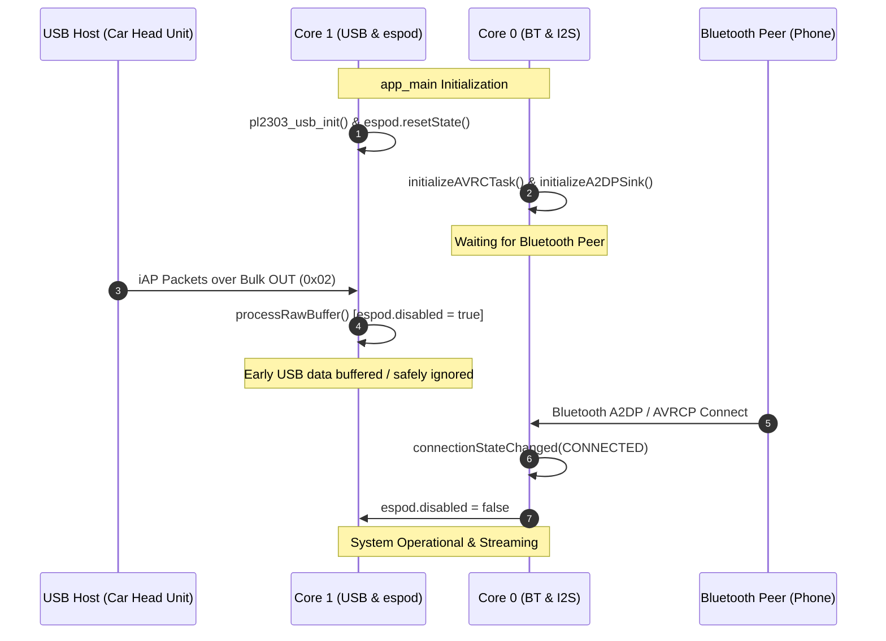
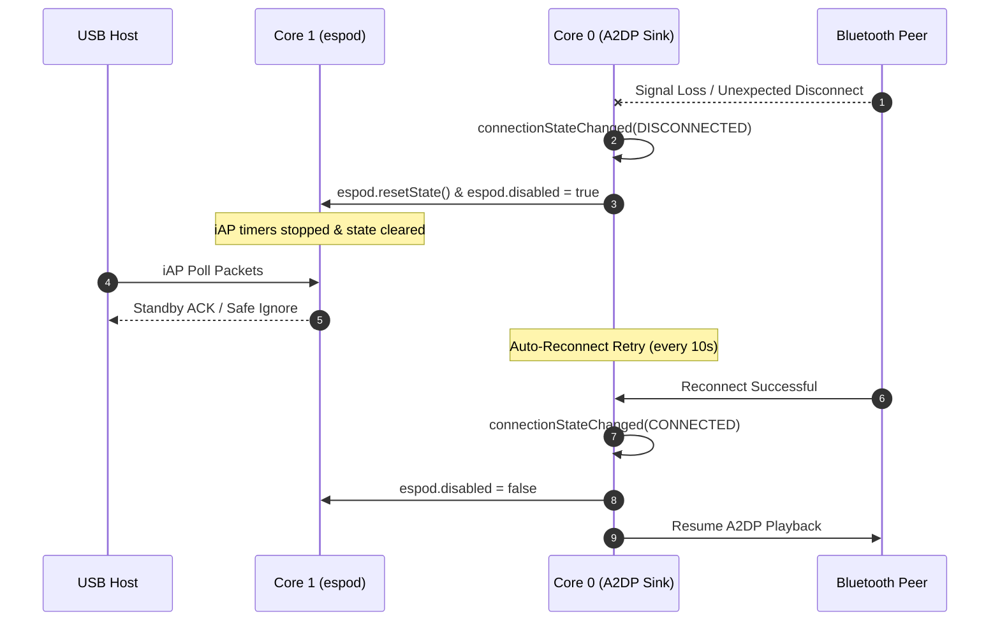
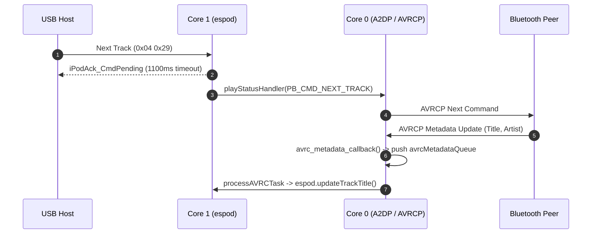

# superPod Use Cases, Event Sequences & Robustness Analysis

This document details the logical event sequences, FreeRTOS task interactions, error recovery mechanisms, communication timeout guards, and CPU priority race condition analysis for the unified **`superPod`** firmware running on the **ESP32-S31**.

---

## 1. Sequence 1: System Boot, Early USB Data & Bluetooth Peer Discovery

### Operational Flow
1. **System Power-On & Initialization (`app_main`)**:
   - `pl2303_usb_init` configures native USB-OTG PL2303 hardware and starts TinyUSB task on **Core 1** (`CONFIG_TINYUSB_TASK_CORE`).
   - `espod` stack initialized on **Core 1** with state reset (`espod.disabled = true`).
   - `usb_espod_bridge_task` launched on **Core 1** (Priority 10).
   - `initializeAVRCTask` and `initializeA2DPSink` start Bluetooth Classic Bluedroid stack and I2S DAC output on **Core 0** (`CONFIG_BT_BLUEDROID_PIN_TO_CORE`).
2. **Early USB Traffic Handling**:
   - If the USB Host (head unit / dock) is plugged in before a Bluetooth peer connects, iAP packets arrive over USB Bulk OUT (`0x02`).
   - `usb_espod_bridge_task` transfers raw bytes into `espod.processRawBuffer()`.
   - Because `espod.disabled` is `true`, non-discovery commands receive an acknowledgment or are ignored safely. Ringbuffers do not overflow, and no unhandled exceptions occur.
3. **Bluetooth Connection Established**:
   - Bluetooth peer pairs and connects. `connectionStateChanged` receives `ESP_A2D_CONNECTION_STATE_CONNECTED`.
   - Sets `espod.disabled = false` and invokes `a2dp_sink.play()`. Full iAP control and metadata synchronization activate.

---

## 2. Sequence 2: Unexpected Bluetooth Disconnection & Auto-Reconnection

### Operational Flow
1. **Active Audio Streaming**:
   - Audio is playing over Bluetooth A2DP to external I2S DAC. AVRCP metadata (Title, Artist, Album, Duration, Position) updates `espod` state via `avrcMetadataQueue`.
2. **Unexpected Bluetooth Disconnection**:
   - Peer moves out of range or loses power. `connectionStateChanged` receives `ESP_A2D_CONNECTION_STATE_DISCONNECTED`.
   - `connectionStateChanged` executes `espod.resetState()` and sets `espod.disabled = true`.
   - Pending iAP timers (`_pendingTimer_0x00`, `_pendingTimer_0x04`) and TX queue items are cancelled cleanly.
3. **Auto-Reconnection Retry Phase**:
   - `a2dp_sink.set_auto_reconnect(true, 10000)` periodically retries peer connection every 10 seconds (`BT_AUTO_RECONNECT_INTERVAL`).
   - During the disconnected state, incoming USB iAP commands from the host are handled without blocking or hanging.
4. **Peer Reconnection**:
   - Peer returns to range and reconnects (`ESP_A2D_CONNECTION_STATE_CONNECTED`).
   - `connectionStateChanged` re-enables `espod` (`espod.disabled = false`) and invokes `a2dp_sink.play()`. Audio and metadata resume seamlessly.

---

## 3. Sequence 3: USB to iAP Stack Robustness & Exception Handling

### A. Interrupted or Truncated USB iAP Packets
- **Threat**: The USB Host sends a corrupted, fragmented, or incomplete iAP header (`0xFF 0x55 [len] ...`).
- **Mitigation**:
  - `_processPacket` verifies the start bytes `0xFF 0x55` and payload length.
  - Computes expected frame checksum `_checksum(lingoPtr, payloadLen)` and compares with received checksum byte `byteArray[3 + payloadLen]`.
  - On mismatch, logs error `Checksum error: calc 0x.. vs rx 0x..` and immediately drops the frame without corrupting state or hanging the task.

### B. USB Host Disconnection & Physical Unplugging
- **Threat**: Physical USB cable disconnect during active iAP transmission.
- **Mitigation**:
  - TinyUSB stack detects bus reset/detach via `TINYUSB_EVENT_DETACHED`.
  - `pl2303_usb_read_bytes` returns `0` bytes cleanly. `usb_espod_bridge_task` delays `pdMS_TO_TICKS(5)`, preventing CPU spinning.
  - Outbound transfers (`pl2303_usb_write_bytes`) check `tud_vendor_mounted()` and `!usbd_edpt_busy()`, avoiding blocking on unmounted endpoints.

### C. High-Frequency Host Polling & Ringbuffer Overflow Protection
- **Threat**: Host sends iAP status requests (`GetPlayStatus` `0x04 0x1C`) at high rate (e.g. 100 Hz).
- **Mitigation**:
  - `processRawBuffer` writes to `_cmdRingBuffer` (size 2048 bytes) using non-blocking `xRingbufferSend` with a 10ms timeout.
  - If buffer is full, excess bytes are safely dropped with warning log `cmdRingBuffer full, dropping X raw bytes`.

---

## 4. Sequence 4: Rapid Track Skipping & AVRCP Race Condition Prevention

### Operational Flow
1. **Rapid Track Skipping**:
   - Host sends multiple `PlayControl` Next Track (`0x04 0x29`) commands in rapid succession.
2. **Asynchronous Command Handling**:
   - `L0x04::processLingo` updates internal track indices, returns `iPodAck_CmdPending` with timeout parameter `TRACK_CHANGE_TIMEOUT` (1100ms) to host, and triggers `playStatusHandler(PB_CMD_NEXT_TRACK)`.
   - `playStatusHandler` dispatches `a2dp_sink.next()` on Core 0.
3. **Decoupled Metadata Queue**:
   - AVRCP metadata updates from Bluetooth stack arrive asynchronously on Core 0.
   - `avrc_metadata_callback` allocates metadata items and pushes them into `avrcMetadataQueue`.
   - `processAVRCTask` (Priority 6) consumes items from queue and updates `espod` track titles/artists safely without blocking Bluetooth ISRs or Core 1 iAP tasks.

---

## 5. Sequence 5: Loopback Prevention in Playback Status Callbacks

### Operational Flow
1. **Host-Initiated Pause**:
   - Host sends `PB_CMD_PAUSE` over iAP.
   - `L0x04` calls `esp->pause()`.
   - `espod::pause()` invokes `_playStatusHandler(PB_CMD_PAUSE)` -> calls `a2dp_sink.pause()`.
2. **Bluetooth Stack Event**:
   - Bluetooth peer pauses stream and notifies ESP32 via `audioStateChanged(ESP_A2D_AUDIO_STATE_REMOTE_SUSPEND)`.
3. **Loopback Guard**:
   - `audioStateChanged` calls `espod.pause(noLoop = true)`.
   - Passing `noLoop = true` prevents `espod.pause()` from invoking `_playStatusHandler()` again, breaking potential infinite recursion between iAP and A2DP.

---

## 6. Comprehensive Communication Timeout Matrix

The following table summarizes all hardware, protocol, and FreeRTOS queue timeout mechanisms enforced in `superPod` for bidirectional communication safety:

| Direction / Subsystem | Timeout Parameter | Value | Trigger Condition | System Guard Action |
| :--- | :--- | :--- | :--- | :--- |
| **USB Inbound (Host -> ESP32)** | `INTERBYTE_TIMEOUT` | **500 ms** | Partial or interrupted iAP packet transfer | Flushes partial packet buffer to prevent framing state contamination. |
| **USB Inbound (Host -> ESP32)** | `SERIAL_TIMEOUT` | **8000 ms** | Multi-chunk frame assembly stall | Resets RX packet assembly state and resumes start-byte scan (`0xFF 0x55`). |
| **USB Inbound (Host -> ESP32)** | `CMD_RING_BUF_TIMEOUT` | **10 ms** | Ringbuffer full under high-frequency host polling | `xRingbufferSend` drops excess bytes with warning log to prevent memory leaks. |
| **USB Outbound (ESP32 -> Host)** | `TX_QUEUE_TIMEOUT` | **50 ms** | FreeRTOS `_txFreeBufferQueue` allocation timeout | Prevents `_queuePacket` from blocking `espod` processing task if USB Bulk IN endpoint stalls. |
| **USB Outbound (ESP32 -> Host)** | `USB_BRIDGE_POLL_INTERVAL` | **5 ms** | Idle USB Bulk OUT endpoint polling | `vTaskDelay(5ms)` prevents task from spinning and starving CPU Core 1. |
| **iAP Lingo 0x04 Protocol** | `TRACK_CHANGE_TIMEOUT` | **1100 ms** | Pending track change / play control ACK | `_pendingTimer_0x04` auto-fires `iPodAck_OK` to host if Bluetooth AVRCP metadata is delayed, preventing head unit UI freeze. |
| **Bluetooth A2DP Subsystem** | `BT_AUTO_RECONNECT_INTERVAL` | **10,000 ms** | Bluetooth peer unexpected disconnect | `a2dp_sink` automatically retries connection every 10s without resetting MCU. |
| **AVRCP Metadata Queue** | `AVRC_QUEUE_SEND_TIMEOUT` | **0 ms (Non-blocking)** | Metadata queue full under rapid track skipping | Drops item and immediately calls `free()` on payload, preventing memory corruption and Bluetooth ISR blocking. |

---

## 7. FreeRTOS Task Priority, Core Allocation & Race Condition Analysis

### Task Allocation & Priority Architecture Matrix

| Core Assignment | FreeRTOS Task | Priority Level | Blocking Primitives / Yield Mechanism | CPU Spin & Race Condition Guard |
| :--- | :--- | :--- | :--- | :--- |
| **Core 0 (PRO_CPU)** | **BT Controller Radio Task** | **23** (Highest) | Event-driven by radio hardware ISRs. | Yields CPU immediately when no RF packets are active. |
| **Core 0 (PRO_CPU)** | **Bluedroid Host Stack** | **20** (High) | FreeRTOS Queue / Event Semaphore. | Blocks waiting for Bluetooth HCI events; zero polling. |
| **Core 0 (PRO_CPU)** | **A2DP Audio & I2S DMA Task** | **18** (Med-High) | I2S DMA Ringbuffer & Audio Stream queue. | Blocks when I2S DMA buffers are full or audio stream is paused. |
| **Core 0 (PRO_CPU)** | **`processAVRCTask`** | **6** (Low) | `xQueueReceive(..., portMAX_DELAY)` | **Zero CPU Spin**: Blocks indefinitely until AVRCP metadata arrives. |
| **Core 1 (APP_CPU)** | **TinyUSB Device Task** | **15** (High) | USB-OTG Hardware Interrupt Semaphore. | Blocks on `tud_task()` event queue when USB bus is idle. |
| **Core 1 (APP_CPU)** | **`usb_espod_bridge_task`** | **10** (Medium) | `vTaskDelay(pdMS_TO_TICKS(5))` | **Over-Polling Prevention**: 5ms yield loop prevents CPU starvation if USB is idle/unplugged. Priority 10 guarantees TinyUSB ISR (Prio 15) preemption. |
| **Core 1 (APP_CPU)** | **`espod` `_processTask`** | **5** (Low) | `xRingbufferReceive(..., portMAX_DELAY)` | **Zero CPU Spin**: Blocks on `_cmdRingBuffer` until raw bytes are pushed. |
| **Core 1 (APP_CPU)** | **`espod` `_txTask`** | **20** (High) | `xQueueReceive(_txQueue, ..., portMAX_DELAY)` | Blocks until packet is queued for outbound Bulk IN transmission. |
| **Core 1 (APP_CPU)** | **`espod` `_timerTask`** | **1** (Lowest) | `xQueueReceive(_timerQueue, ..., portMAX_DELAY)` | Blocks until a software timer (e.g. `TRACK_CHANGE_TIMEOUT`) expires. |

### Race Condition & Priority Inversion Safeguards

1. **Strict Core Separation (Option B Swapped)**:
   - **Core 0** handles time-critical real-time radio tasks (Bluetooth Controller Prio 23, Bluedroid Host Prio 20, A2DP Audio Prio 18).
   - **Core 1** handles USB-OTG hardware and iAP protocol logic (TinyUSB Prio 15, Bridge Prio 10, espod Prio 5).
   - Radio operations on Core 0 are completely isolated from USB processing on Core 1, eliminating cross-core interrupt starvation.

2. **Cross-Core Thread-Safe Messaging**:
   - `avrc_metadata_callback` (executing inside Bluedroid context on Core 0) does **NOT** directly mutate `espod` object state on Core 1.
   - Instead, metadata string payloads are copied into heap-allocated `avrcMetadata` structs and enqueued to `avrcMetadataQueue`.
   - `processAVRCTask` (Priority 6) safely processes the queue and invokes `espod` track state updates on Core 1.

3. **Priority Inversion & Over-Polling Avoidance**:
   - `usb_espod_bridge_task` (Priority 10) runs *below* TinyUSB task (Priority 15), ensuring USB-OTG hardware interrupts and endpoint descriptors are processed with priority.
   - `vTaskDelay(pdMS_TO_TICKS(5))` inside `usb_espod_bridge_task` prevents empty loop CPU spinning when no USB Bulk OUT data is arriving.
   - All other processing tasks (`_processTask`, `processAVRCTask`, `_txTask`, `_timerTask`) use `portMAX_DELAY` blocking primitives, consuming **0.0% CPU** when idle.
