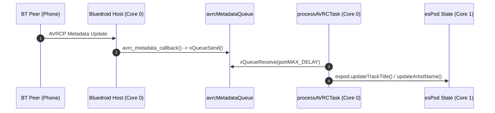

# `bt_a2dp_sink` Theory of Operation (TOO)

## Architecture Overview

The `bt_a2dp_sink` component abstracts Espressif's Bluedroid Bluetooth stack (`esp_a2dp.h` and `esp_avrc.h`) into a thread-safe C/C++ API tailored for single-MCU integration.

### Core 0 Real-Time Pinning
To prevent audio sample underruns and Bluetooth packet loss:
- Bluetooth Controller Radio Task runs at Priority 23 on Core 0.
- Bluedroid Host Stack Task runs at Priority 20 on Core 0.
- A2DP Audio Decoding & I2S DMA Task runs at Priority 18 on Core 0.

### Decoupled AVRCP Metadata Pipeline
1. When Bluetooth peer sends track metadata (Title, Artist, Album, Duration, Position), Bluedroid triggers `avrc_metadata_callback` on Core 0.
2. `avrc_metadata_callback` allocates string memory and enqueues item into `avrcMetadataQueue` (`CONFIG_AVRC_QUEUE_SIZE`).
3. Low-priority task `processAVRCTask` (Priority 6) receives items from `avrcMetadataQueue` and updates `espod` state safely on Core 1 without blocking Bluedroid event dispatchers.

## Related Links
- [Component API Reference](API.md)
- [Component README](../README.md)
- [System Theory of Operation](../../../TOO.md)
