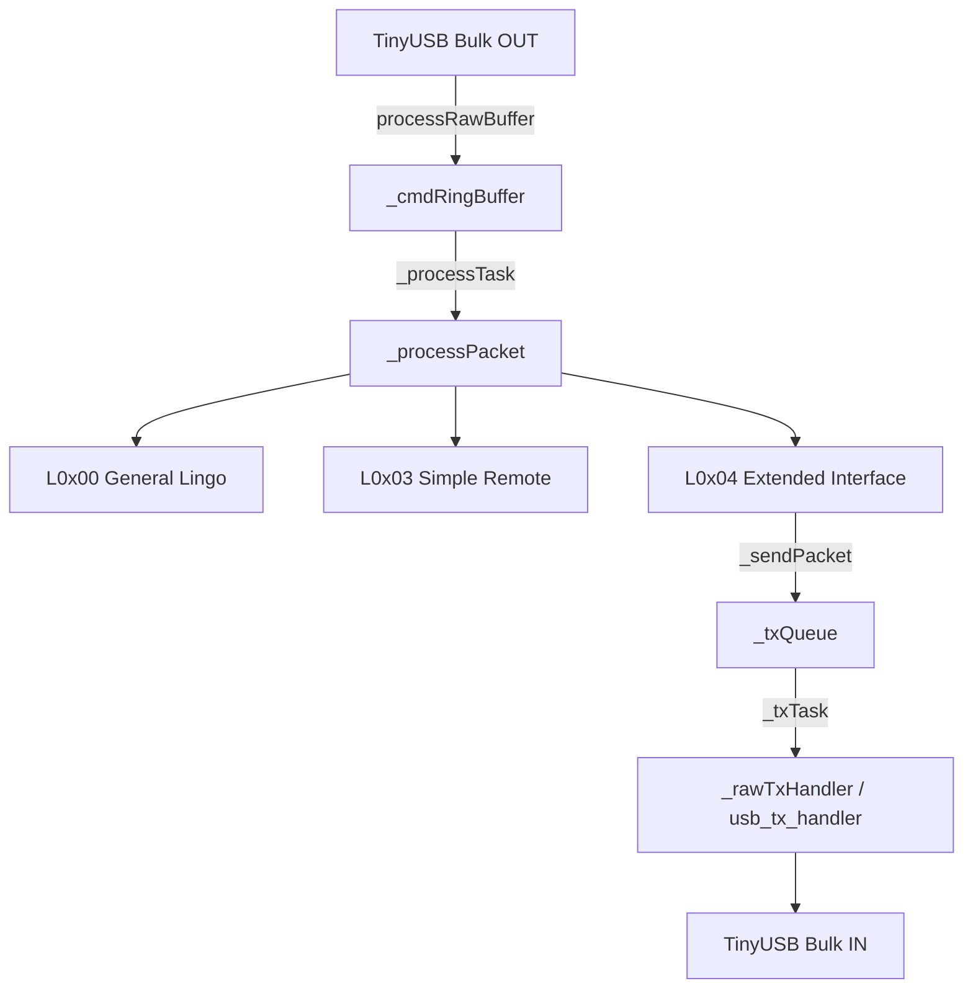

# `espod` Theory of Operation (TOO)

## Architecture Overview

The `esPod` class operates as an event-driven iAP protocol state machine executing on FreeRTOS tasks pinned to Core 1.

### 1. Ingestion Pipeline
Raw iAP byte streams from USB Bulk OUT endpoint are pushed into lock-free ringbuffer `_cmdRingBuffer` (size 2048 bytes) via `processRawBuffer()`.

### 2. Processing Pipeline (`_processTask`)
- `_processTask` blocks on `xRingbufferReceive(..., portMAX_DELAY)`.
- It verifies preamble `0xFF 0x55` and frame checksum before passing command payload to the target Lingo handler (`L0x00::processLingo`, `L0x03::processLingo`, `L0x04::processLingo`).

### 3. Outbound Transport Pipeline (`_txTask`)
- Lingo handlers construct response packets wrapped in `0xFF 0x55 [len] [payload] [checksum]` and push them to `_txQueue`.
- `_txTask` blocks on `xQueueReceive(_txQueue, ..., portMAX_DELAY)`.
- When dequeued, if `_rawTxHandler` is attached (via `attachTxHandler`), `_txTask` invokes the handler (`usb_tx_handler` -> `pl2303_usb_write_bytes`).

### 4. Software Timers & Pending ACKs (`_timerTask`)
- Commands requiring delayed acknowledgment (e.g. track change requests waiting on Bluetooth AVRCP metadata) start a software timer (`_pendingTimer_0x04`).
- Upon expiration, `_pendingTimerCallback` enqueues a message to `_timerQueue`, waken `_timerTask` to auto-fire `iPodAck_OK` to the accessory host.

## Related Links
- [Component API Reference](API.md)
- [Component README](../README.md)
- [System Theory of Operation](../../../TOO.md)
