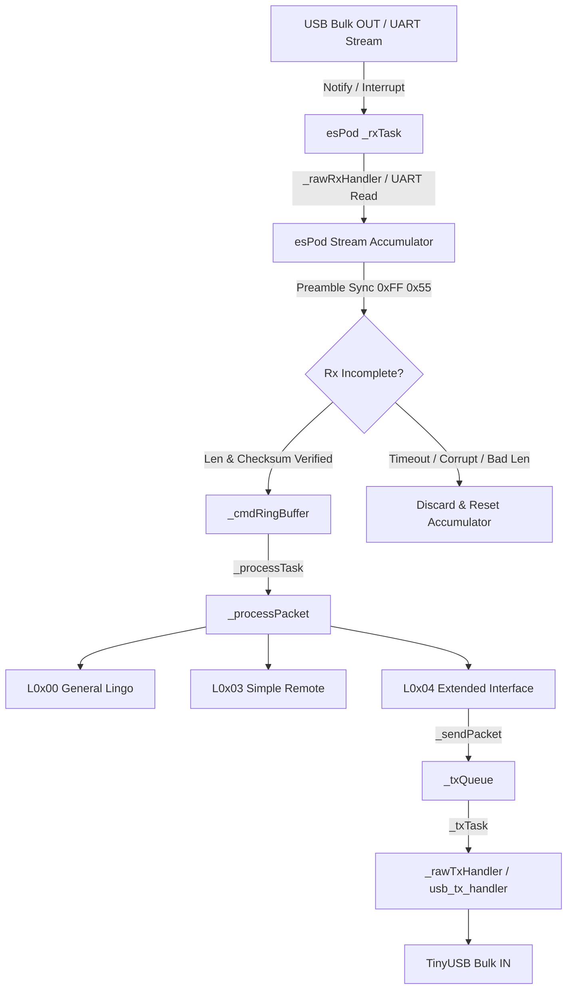
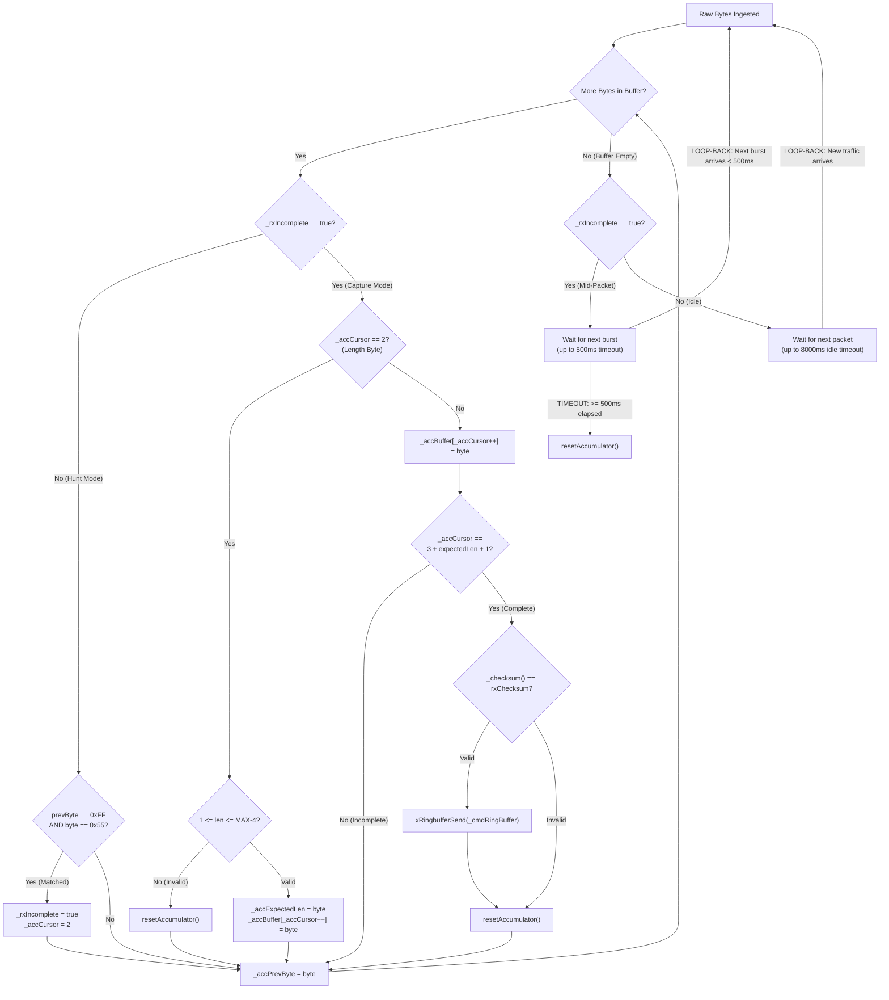

# `espod` Theory of Operation (TOO)

## Architecture Overview

The `esPod` class operates as an event-driven iAP protocol state machine executing on FreeRTOS tasks pinned to Core 1.

### 1. Ingestion Pipeline & Universal `_rxTask`
Raw iAP byte streams from physical UART or USB Bulk OUT endpoints enter `esPod` via its universal `_rxTask`.
- When operating over USB, an external transport callback is registered via `attachRxHandler(pl2303_usb_read_bytes)`.
- When incoming USB Bulk OUT packets arrive, `tud_vendor_rx_cb()` fires `xTaskNotifyGive()` to the handle returned by `getRxTaskHandle()`.
- `_rxTask` executes an event-driven loop with dynamic `ulTaskNotifyTake` wait ticks:
  - **Mid-packet inter-byte timeout (500 ms)**: Enforced when `_rxIncomplete == true`. If the stream stalls for $\ge 500\text{ ms}$, `resetAccumulator()` is called and partial data is discarded.
  - **Serial idle timeout (8000 ms) with debounce latch**: Enforced when idle. If 8000 ms elapses without data, `resetState()` is invoked and `serialTimedOut` latches `true` (transitioning wait to `portMAX_DELAY` to eliminate repeated reset thrashing).
- Read bytes enter `processRawBuffer()`, where the internal accumulator hunts for `0xFF 0x55` (absorbing multi-`0xFF` padding), extracts length, accumulates payload, and verifies two's complement checksum. Complete packets are safely pushed to `_cmdRingBuffer`.

### 2. Processing Pipeline (`_processTask`)
- `_processTask` blocks on `xRingbufferReceive(..., portMAX_DELAY)`.
- It verifies preamble `0xFF 0x55` and frame checksum before passing command payload to the target Lingo handler (`L0x00::processLingo`, `L0x03::processLingo`, `L0x04::processLingo`).

### 3. Outbound Transport Pipeline (`_txTask`)
- Lingo handlers construct response packets wrapped in `0xFF 0x55 [len] [payload] [checksum]` and push them to `_txQueue`.
- `_txTask` blocks on `xQueueReceive(_txQueue, ..., portMAX_DELAY)`.
- When dequeued, if `_rawTxHandler` is attached (via `attachTxHandler`), `_txTask` invokes the handler (`usb_tx_handler` -> `pl2303_usb_write_bytes`).

### 4. Software Timers & Pending ACKs (`_timerTask`)
- Commands requiring delayed acknowledgment (e.g. track change requests waiting on Bluetooth AVRCP metadata) start a software timer (`_pendingTimer_0x04`).
- Upon expiration, `_pendingTimerCallback` enqueues a message to `_timerQueue`, waken `_timerTask` to auto-fire `iPodAck_OK` to the accessory host.

## Related Links
- [Component API Reference](API.md)
- [Component README](../README.md)
- [System Theory of Operation](../../../TOO.md)
